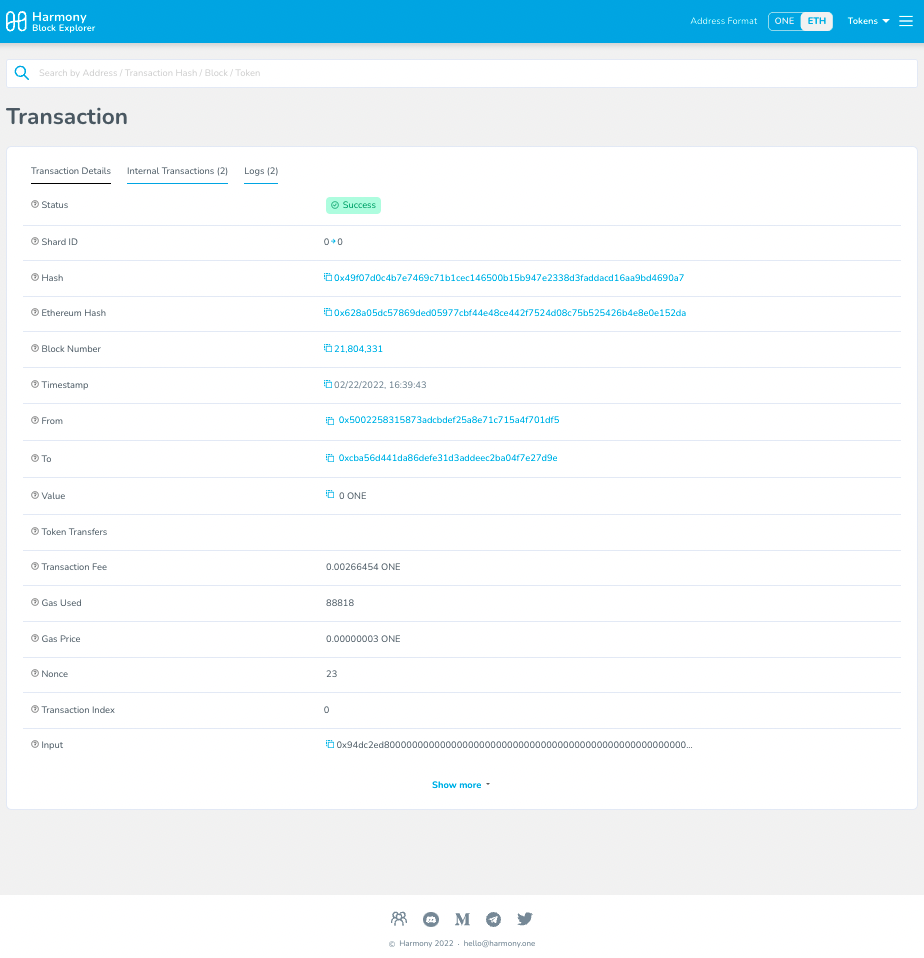
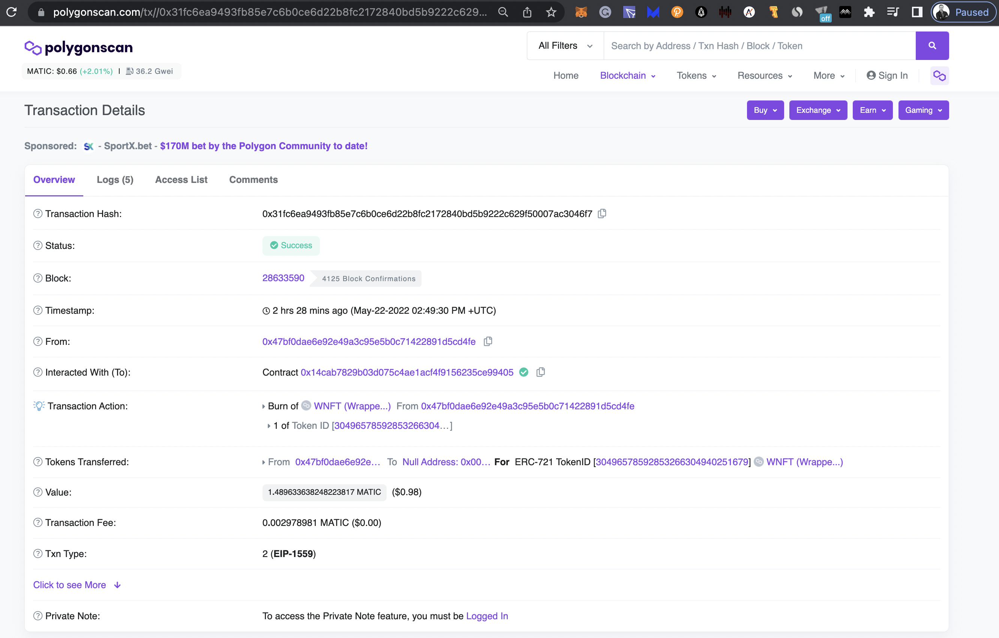
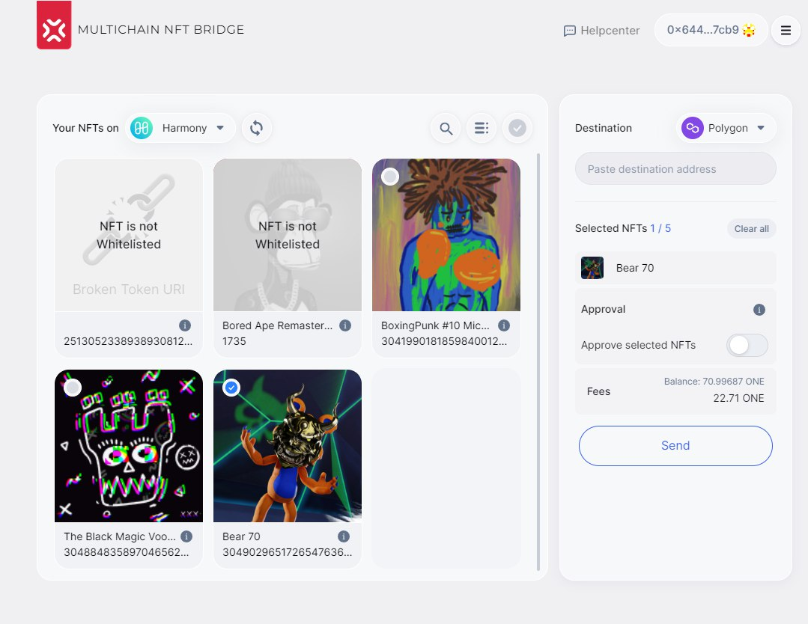

# Harmony Grant Delivery Report

The present report documents integrating Harmony Testnet into XP.network Multi-Chain NFT Bridge.

Harmony is assigned the internal bridge nonce #12:
```typescript
export const HARMONY: Web3Nonce = 0xc;
```

1. The other Bridge related smart contract addresses: https://docs.xp.network/docs/Testnet/smartContracts
2. The XP.network NFT Bridge in the testnets of blockchains is available at: https://testnet.bridge.xp.network/


## Bridge Smart Contracts Deployed on Harmony Testnet

Creator address: one1p47lggq5qe9pv00a5szz20af76yrhyv8r6e346

| SC Name / Type | Address|
|:-:|:-:|
|UserNftMinter|0x57d2Ad1a14C77627D5f82B7A0F244Cfe391e59C5 <br/> one12lf26xs5camz040c9daq7fzvlcu3ukw9txkkkd|
|Erc1155Minter|0xbED4a5b36fae07943589a0b34CC2Ec3a1c208E53 <br/> one1hm22tvm04cregdvf5ze5eshv8gwzprjn20frdv|
|XPNft1155|0x7cB14C4aB12741B5ab185C6eAFb5Eb7b5282A032 <br/> one10jc5cj43yaqmt2cct3h2ld0t0dfg9gpjrxgkjn|
|XPNft|0x0AA29baB4F811A9f3dcf6a0F9cAEa9bE18ECED78 <br/> one1p23fh260sydf70w0dg8eet4fhcvwemtcmknt67|
|Minter|0xCbA56d441da86dEfe31d3AdDeEc2bA04f7e27d9e <br/> one1ewjk63qa4pk7lcca8tw7as46qnm7ylv7exqnh3|

## 1. Sending NFTs

<br/>

1.1 **Selecting** an NFT from the list of available:<br/>


<br/>
1.2 Approving the bridge smart contract as an *operator* of the selected NFT:<br/>


<br/>
1.3 After approval, a user can start sending the selected NFT:<br/>


<br/>
1.4. Signing the Sending transaction and paying the fees:<br/>


## 2. Viewing the results of the transaction
<br/>
2.1 Bridge pop-up window notifying the user about success:<br/>


<br/>
2.2 Transaction on the chain of departure (harmony):<br/>

```
https://explorer.testnet.harmony.one/tx/0x62b05a8d45e19aea78db50693a22c26fa8fd2192297044c879da5fd80202b160
```

<br/>
2.3 Viewing the transaction in the explorer of the chain of NFT origin:<br/>


## 3. Receiving NFTs

<br/>
3.1 Viewing the transaction on the chain of destination:<br/>

```
https://testnet.snowtrace.io/tx/0x3162d691ab8e8b6937ad328d22a7bf7acf1026d37a56a9b1c95d3bfcf081113b
```


<br/>
3.2 NFT is gone from the chain of origin (Harmony):<br/>


<br/>
3.3 Viewing NFTs on the chain of destination (e.g. Avalance):<br/>


## 4. Returning a wrapped NFT to Harmony

<br/>
4.1 Selecting a wrapped NFT to be sent <br/>


<br/>
4.2 Approving the bridge contract as an operator of the NFT:<br/>


<br/>
4.3 After approving has succeeded, a user can send the NFT to Harmony:<br/>


<br/>
4.4 Signing the transaction and paying the fees in <br/>


<br/>
4.5 Bridge pop-up window signifying success of the operation:<br/>


<br/>
4.6 Vewing the transaction in the explorer of the chain of origin (Avalanche):<br/>
```
https://testnet.snowtrace.io/tx/0xfd74106bde337d038128b3f6e677dc8d41a95337d01afcb03a9cadddd797faec
```
<br/>


<br/>
4.7 NFTs are gone from Avalanche:<br/>


## 5. Receiving Native NFT on Harmony

5.1 Viewing the transaction in the destination chain explorer (Harmony):
```
https://explorer.testnet.harmony.one/tx/0x628a05dc57869ded05977cbf44e48ce442f7524d08c75b525426b4e8e0e152da
```


<br/>
5.2The NFT has successfully arrived to its native chain:<br/>


# Adding Harmony to the mainnet

## Milestone Delivery

|#|Milestone|Deliverables|
|:-:|:-:|:-|
|1|Smart contracts|1. [Support ERC-721](https://github.com/XP-NETWORK/XP.network-HECO-Migration/blob/dist/dist/BridgeNFT.d.ts)<br/>2. [Support ERC-1155](https://github.com/XP-NETWORK/XP.network-HECO-Migration/blob/dist/dist/Erc1155Minter.d.ts)<br/>3. [Freeze/Unfreeze Native NFTs](https://github.com/XP-NETWORK/XP.network-HECO-Migration/blob/f474704150da557f931e011026d0c033b391bd7a/dist/Minter.d.ts#L160)<br/>4. [Mint/Burn wrapped NFTs](https://github.com/XP-NETWORK/XP.network-HECO-Migration/blob/f474704150da557f931e011026d0c033b391bd7a/dist/Minter.d.ts#L160)<br/>5. [Pay the TX fees on the target chain in native tokens](https://github.com/XP-NETWORK/XP.network-HECO-Migration/blob/f474704150da557f931e011026d0c033b391bd7a/dist/Minter.d.ts#L295)<br/>6. [Send / Receive NFTs in batches](https://github.com/XP-NETWORK/XP.network-HECO-Migration/blob/dist/dist/BridgeNFTBatch.d.ts)|
|2|Integration into Validators|We've added Harmony to the [Validators](https://github.com/XP-NETWORK/migration-validator/search?q=Harmony)|
|3|Backend Integration|1. [NFT Index](#nft-indexing-for-harmony)<br/>2. [TX Fee Estimator](#fee-estimation-on-harmony)<br/>3. [Crypto-currency converter](#fee-estimation-on-harmony)|
|4|UI Integration|1. [User Interface](#mainnet-ui-integration)<br/>2. [Wallets (Metamask, WalletConnect)](#wallets-support)|

## Mainnet UI Integration

Harmony can be found the [production version of the bridge](https://bridge.xp.network/) connecting 14+ blockchain mainnets.


### Wallets Support

Harmony is supported though Metamask & WalletConnect (for the mobile interaction)


Switching Metamask to Harmony:


### NFT Indexing for Harmony


## Mainnet transactions

1.1. Sending an NFT Polygon -> Harmony

Transaction on Polygon: [0x31fc6ea9493fb85e7c6b0ce6d22b8fc2172840bd5b9222c629f50007ac3046f7](https://polygonscan.com/tx//0x31fc6ea9493fb85e7c6b0ce6d22b8fc2172840bd5b9222c629f50007ac3046f7)



1.2 Destination Transaction on Harmony: [0x35533f9b3c97e7ced6ebeb14cb90b954e1131c02b15b2a635923cd827e4ae973](https://explorer.harmony.one/tx/0x35533f9b3c97e7ced6ebeb14cb90b954e1131c02b15b2a635923cd827e4ae973)


2.1 Sending from Harmony -> Polygon


Transaction on Harmony: [0x290e695463e621f46405f3edd8caf4cc70173182c3a35cea1c1f07c065eb11fc](https://explorer.harmony.one/tx/0x290e695463e621f46405f3edd8caf4cc70173182c3a35cea1c1f07c065eb11fc)


2.2. Receiving on Polygon

Transaction on Polygon: [0xe8db8d1dd9a5e08798727727b2e17c4242955a5c9f5285b9aafee8247acaec5f](https://polygonscan.com/tx/0xe8db8d1dd9a5e08798727727b2e17c4242955a5c9f5285b9aafee8247acaec5f)


### Fee estimation on Harmony



## Smart Contracts Whitelisted on Harmony 

https://xpnet-whitelisted-api.herokuapp.com/12

https://docs.xp.network/docs/whitelistedv2.0/harmony

# Testing JavaScript Library

### 1. Install the libraries required for the project:

<br/>

```bash
yarn add xp.network @elrondnetwork/erdjs ethers @taquito/taquito @temple-wallet/dapp
```

OR

```bash
npm i --save xp.network @elrondnetwork/erdjs ethers @taquito/taquito @temple-wallet/dapp
```

To import the latest version of xp.network v.2.0 library:

```bash
yarn add "git+https://github.com/xp-network/xpjs#bleeding-edge" @elrondnetwork/erdjs ethers @taquito/taquito @temple-wallet/dapp
```

<br/>

### 2. Importing the dependencies<br/><br/>

```javascript
import {
    ChainFactoryConfigs,
    ChainFactory,
    Chain,
    AppConfigs,
    ChainParams
} from "xp.network";

(async () => {
    // Instantiate the chain factory for the
    // Connecting to the mainnnets of all the blockchains:
    const mainnetConfig = await ChainFactoryConfigs.MainNet()
    const mainnetFactory: ChainFactory = ChainFactory(
        AppConfigs.MainNet(),
        mainnetConfig
    );

    // Connecting to the testnets of all the blockchains:
    const testnetConfig = await ChainFactoryConfigs.TestNet();
    const testnetFactory: ChainFactory = ChainFactory(
        AppConfigs.TestNet(),
        testnetConfig
    );

    // Switching between the mainnets & the testnets:
    const factory: ChainFactory = mainnetFactory;
    const CONFIG: Partial<ChainParams> = mainnetConfig;
})();
```

<hr/><br/>

## 3. Get the signer objects

### 3.1 Example of getting the signer object (for manual EVM testing in the BE)

Avoid using 3.1 setup in production. Use it for initial or backend testing only.
<br/>

Add your private key to the environment:
```bash
touch .env
echo "SK=<Replace this with your Private Key>" >> .env
```

```javascript
// EVM chains compatible wallet:
import { Wallet } from "ethers";
import { config } from 'dotenv';
config();
// EVM signer for testing in the BE
const signer = new Wallet(
     process.env.SK!,
     // Replace 'harmonyParams'
     // with the relevant parameter
     // from the table below
     CONFIG.harmonyParams?.provider
);
```

<center>

|Chain|Parameters|Chain Nonce|
| :-: | :-: |:-:|
|  Elrond   |  elrondParams   |2|
|    BSC    |    bscParams    |4|
| Ethereum  |  ropstenParams  |5|
| Avalanche | avalancheParams |6|
|  Polygon  |  polygonParams  |7|
|  Fantom   |  fantomParams   |8|
|   Tron    |   tronParams    |9|
|  `Harmony`  |  `harmonyParams`  |`12`|
|   xDai    |   xDaiParams    |14|
|Algorand|algorandParams|15|
|Fuse|fuseParams|16|
|Tezos|tezosParams|18|
|Velas|velasParams|19|
|Aurora|auroraParams|21|
|Godwoken|godwokenParams|22|
|Gatechain|gatechainParams|23|
|VeChain|vechainParams|25|

</center><br/>

### 3.2 Example of getting the signer object (in the FE for web3):<br/><br/>

```typescript
// EVM chains compatible signer:
import ethers from "ethers";
const signer = new ethers.providers.Web3Provider(window.ethereum).getSigner();
```

### 4. Getting the inner objects from this factory to be used for transferring, minting, and estimation of gas fees.<br/><br/>

```javascript
(async () => {
// Inner Object ================================ Chain Nonce
    const bsc       = await factory.inner(Chain.BSC);       // 4
    const ethereum  = await factory.inner(Chain.ETHEREUM);  // 5
    const avax      = await factory.inner(Chain.AVALANCHE); // 6
    const polygon   = await factory.inner(Chain.POLYGON);   // 7
    const fantom    = await factory.inner(Chain.FANTOM);    // 8
    const harmony   = await factory.inner(Chain.HARMONY);   // 12 <==========
    const gnosis    = await factory.inner(Chain.XDAI);      // 14
    const fuse      = await factory.inner(Chain.FUSE);      // 16
    const velas     = await factory.inner(Chain.VELAS);     // 19
    const aurora    = await factory.inner(Chain.AURORA);    // 21
    const godwoken  = await factory.inner(Chain.GODWOKEN);  // 22
    const gatechain = await factory.inner(Chain.GATECHAIN); // 23
    const vechain   = await factory.inner(Chain.VECHAIN);   // 25

    // Non-EVM chains:
    // Inner Object ================================ Chain Nonce
    const elrond    = await factory.inner(Chain.ELROND);    // 2
    const tron      = await factory.inner(Chain.TRON);      // 9
    const algorand  = await factory.inner(Chain.ALGORAND);  // 15
    const tezos     = await factory.inner(Chain.TEZOS);     // 18
})();
```

<hr/><br/>

### 5.1 Listing NFTs Owned by the sender.<br/><br/>

This operation does not depend on a wallet since reading operations are free and, therefore, do not require signing.
<br/>

```javascript
(async () => {
  // EVM:
  const web3Nfts = await factory.nftList(
    harmony, // The chain of interest
    "0x...." // The public key of the NFT owner in a web3 chain
  );
})();
```

### 7. Transferring an NFT<br/><br/>

```javascript
(async () => {
  // EVM compatible chains example:
  const web3Result = await factory.transferNft(
    harmony,        // The Source Chain.
    polygon,        // The Destination Chain.
    theChosenOne,   // The NFT object you have chosen from the list.
    signer,         // The web3 signer object (see p. 3.2 above).
    "ADDRESS OF THE RECEIVER" // The address whom you are transferring the NFT to.
  );
  console.log(web3Result);
})();
```